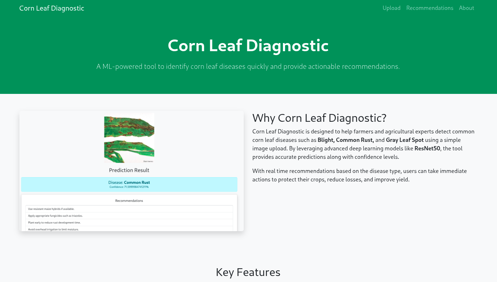
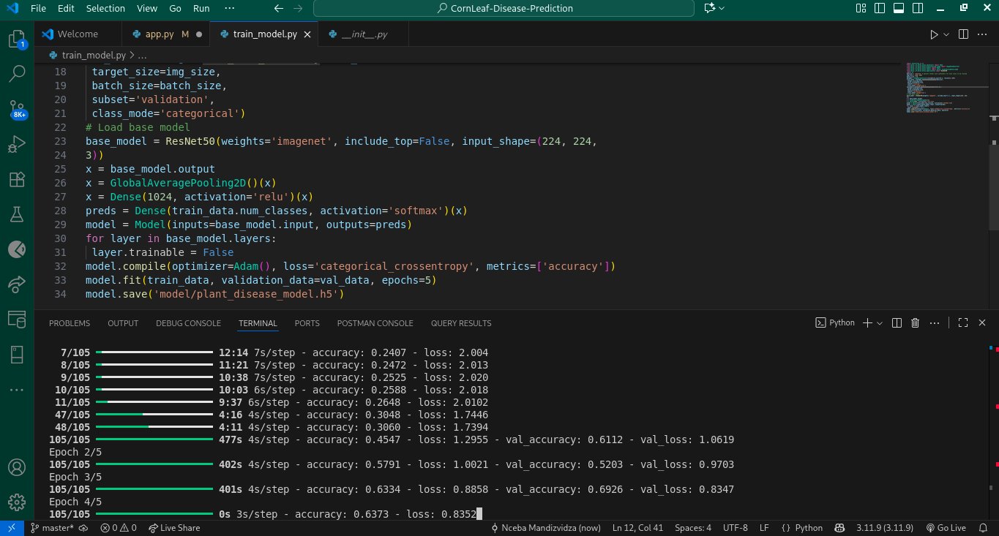
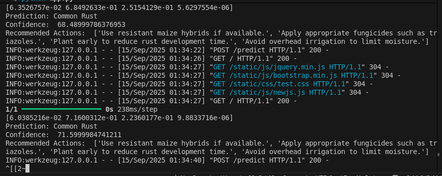

# 🌿 Plant Disease Diagnosis Flask Web App

[](https://www.python.org/)
[](https://flask.palletsprojects.com/)
[](LICENSE)

An AI-powered web application built with **Flask** for diagnosing corn leaf diseases from images using a pre-trained deep learning model.

---

## 🔍 Overview

Upload images of corn leaves and get **real time predictions** of potential diseases.  
Uses a **ResNet50 model** trained on the PlantVillage dataset for accurate classification.

---

## ✨ Features

- 🖼️ **Upload Images**: Simple and intuitive interface.
- ⚡ **Instant Predictions**: Fast and accurate results.
- 🧠 **Pre-Trained Model**: ResNet50 for reliability.
- 📊 **Visual Feedback**: See your image alongside predicted disease.

---

## 🖥️ Screenshots

**Home Page**  


**Model Training**  


**Prediction Requests**  


---

**Dataset**
https://www.kaggle.com/datasets/smaranjitghose/corn-or-maize-leaf-disease-dataset

## 🛠️ Installation

1. Clone the repository:

```bash
git clone https://github.com/Mandizvidzafn/CornLeaf-Disease-Prediction.git
cd CornLeaf-Disease-Prediction
pip install -r requirements.txt
python app.py

**Dataset**
